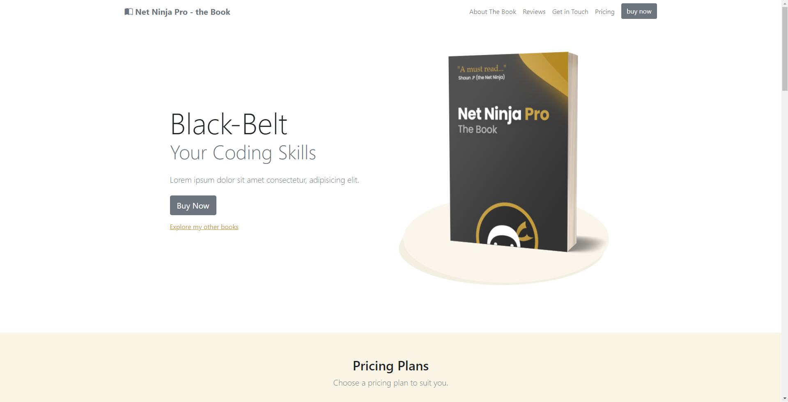

<h1 align="center">Book Site</h1>

 <a href="#description">Project Description</a> •
 <a href="#instalation">Instalation</a> • 
 <a href="#technologies">Tecnologies</a> • 
 <a href="#autor">Author</a> • 
 <a href="#images">Images</a>

## 💻 Project Description

 Book Site is a simple site done based in NET Ninja youtube's channel course about bootstrap. It uses lots of components of Bootstrap 5 and it was important to solidify concepts about utilization of Bootstrap 5.

NET Ninja - Bootstrap -  [Video](https://www.youtube.com/playlist?list=PL4cUxeGkcC9joIM91nLzd_qaH_AimmdAR)

## 📦 Instalation

### Prerequisites
It is a simple webpage, you can clone the project or in your computer and run in the browser or run a tool like Live Server of Visual Studio Code.
You can also just access the online version through GitHub Pages
Befor you begin you'll need the following tools:

[Git](https://git-scm.com)
[Node](https://nodejs.org/en/)

## 🛠 Tecnologies

The following resources are used in this project
- [Bootstrap](https://getbootstrap.com/)
- [Sass](https://sass-lang.com/)

## 👨‍💻 Autor
<a href="https://www.linkedin.com/in/ikaroamorimesilva/">
 
  
 <b>Ikaro Amorim e Silva</b>
 </a>

Done with ❤️ by Ikaro Amorim e Silva

  

## 🌍 Images and Videos

   

